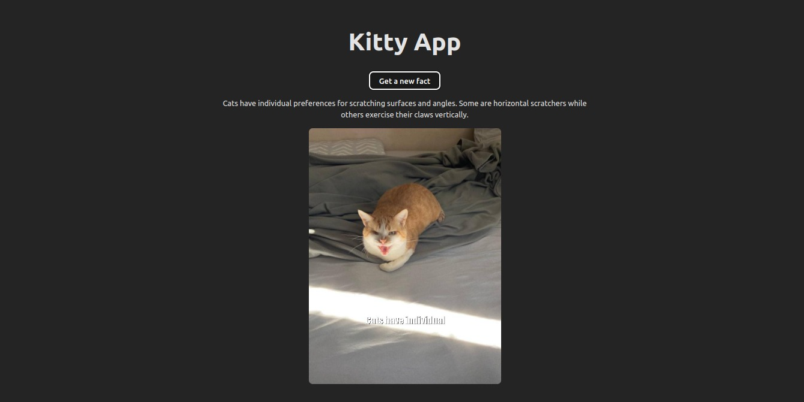

# Cat Random Fact

## Introduction

This is a technical test for a React developer position. The goal is to create a simple app that displays a random cat fact and a random cat image.

### Preview

### Instructions

- Get a random cat fact from the [Facts API](https://catfact.ninja/fact)
- Get a random cat image from the [Images API](https://cataas.com/cat/says/hello) (replace `hello) with
the first 3 words of the fact)
- Display the fact and the image on the page

## Development

Run `pnpm install` to install the dependencies. Then run `pnpm run dev` to start the development server.

## Testing

Run `pnpm test` to run the tests.

## Deployment

Run `pnpm build` to build the app for production. The build is minified and the filenames include the hashes.
