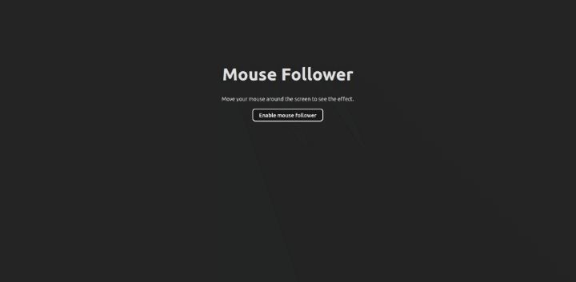

# Mouse Follower

## Description

This is a simple example of how to use a `MouseFollower` component to follow the mouse cursor.

### Preview

## Development

Run `pnpm install` to install the dependencies. Then run `pnpm run dev` to start the development server.

## Deployment

Run `pnpm build` to build the app for production. The build is minified and the filenames include the hashes.
