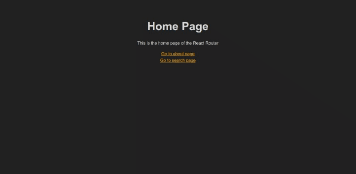

# React Router

## Description

This is a simple clon of the [React Router](https://reactrouter.com/) library.

### Features

- [x] `Link` component with `to` prop. It renders an `a` tag with the `href` attribute set to the `to` prop.
- [x] `Route` component with `path` and `component` props. It renders the component if the path matches the current URL.
- [x] `Router` component with `routes` prop. It renders the first `Route` that matches the current URL.

### Extra features

- [x] `lazy` function to load components asynchronously with `React.lazy`.
- [x] `Suspense` component to show a fallback component while the component is loading with `React.Suspense`.

### Preview

## Development

Run `pnpm install` to install the dependencies. Then run `pnpm run dev` to start the development server.

## Deployment

Run `pnpm build` to build the app for production. The build is minified and the filenames include the hashes.

## Publishing

You need to be logged in to the [npm registry](https://www.npmjs.com/) to publish the package. Run `pnpm publish` to publish the package.
