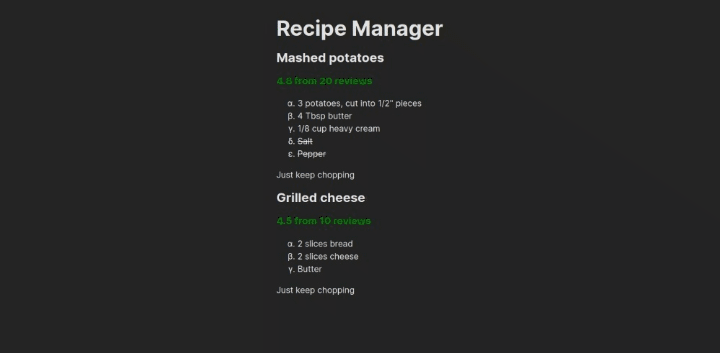

# Recipe Manager

> ✨ Bootstrapped with Create Snowpack App (CSA).

## Introduction

This project is a part of the [Microsoft Learn: React](https://docs.microsoft.com/learn/paths/react/) path. It is a simple recipe manager that allows you to mark the ingredients you have and the ones you don't.

### Preview

## Development

Run `pnpm install` to install the dependencies. Then run `pnpm start` to start the development server. Open <http://localhost:8080> to view it in the browser.

## Deployment

Run `pnpm build` to build the app for production. The build is minified and the filenames include the hashes. Your app is ready to be deployed!
