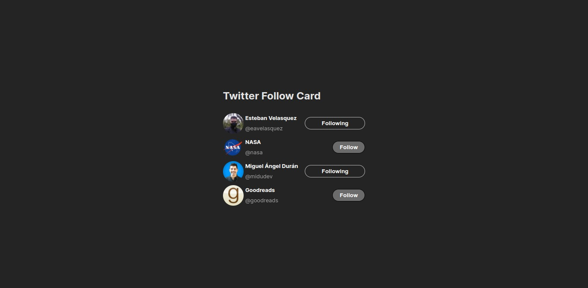

# Twitter Follow Card

## Description

This is a simple example of the Twitter Follow Card. It is a card that allows you to follow a Twitter account.

## Preview

## Development

Run `pnpm install` to install the dependencies. Then run `pnpm run dev` to start the development server.

## Deployment

Run `pnpm build` to build the app for production. The build is minified and the filenames include the hashes.
